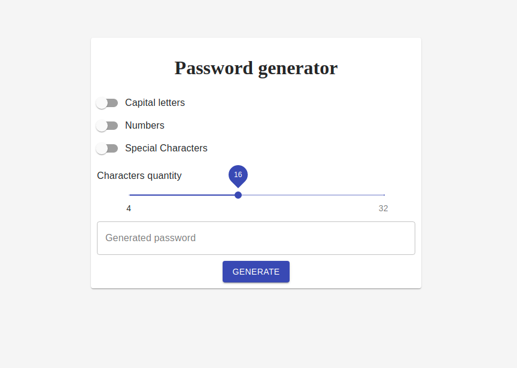

<h1 align="center">Password Generator</h1>

<h2 align="center">
  <a href="https://random-password-creator.netlify.app/">🖥 Preview</a>
</h2>

## 

---

## 🚀 Challenge

[Link da Challenge 09 da FW7](https://github.com/fw7-solucoes/challenges/tree/master/challenge-9).

---

## 📃 Sobre

Esse desafio tem como objetivo construír uma interface para gerar senhas aleatórias, tendo a possibilidade do usuário escolher a quantidade de caracteres em um range de 4 e 32 caracteres. Na interface também deve haver uma a possibilidade de configurar como será as senhas geradas, se irá permitir gerar letra maiúscula, números e símbolos.

 

---

## ✅ Objetivos

- Deve ser possível escolher a quantidade de caracteres a serem gerados. (4 - 32)
- Deve ser possível permitir ou não letrar maiúsculas. (A, B, C...)
- Deve ser possível permitir ou não números. (1, 2, 3...)
- Deve ser possível permitir ou não símbolos. (!, @, #...)
- Deve ser possível gerar uma senha aleatória.

Você pode ver o resultado final aqui: [Preview](https://random-password-creator.netlify.app/).

by [Anderson Espindola](https://www.linkedin.com/in/anderson-espindola/)
